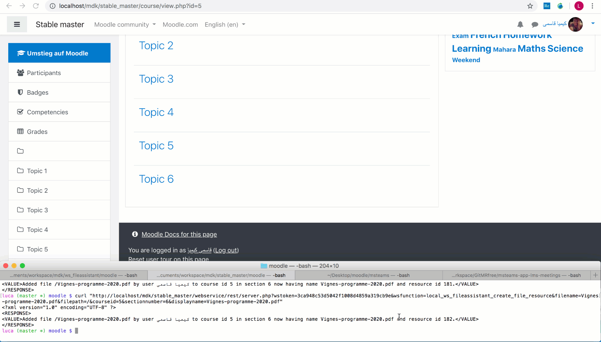

# File assistant web service #

The local_ws_fileassistant Moodle web service helps accomplishing the task to push files from your 'private files' repository to a
Moodle course.

Since this functionality is missing but would be greatly appreciated by lecturers who want to create their own scripts to push their
lecture materials to their courses using the command line, here's a way to make this possible.

See below for an example cURL command. More featureful clients are available in the `clients/` subdirectory.

# Usage #

Given a file exists in a user's "Private files", e.g. pdf1.pdf, the user is able to push it to a Moodle course by the CLI command

`curl "http://<host>/webservice/rest/server.php?wstoken=<token>&wsfunction=local_ws_fileassistant_create_file_resource&filename=pdf1.pdf&courseid=5&sectionnumber=2&displayname=file.pdf"`

The token has first to be taken from Dashboard → Preferences → User account → Security keys.

## License ##

2020 Nina Herrmann <nina.herrmann@uni-muenster.de> Luca Bösch <luca.boesch@bfh.ch>

This program is free software: you can redistribute it and/or modify it under
the terms of the GNU General Public License as published by the Free Software
Foundation, either version 3 of the License, or (at your option) any later
version.

This program is distributed in the hope that it will be useful, but WITHOUT ANY
WARRANTY; without even the implied warranty of MERCHANTABILITY or FITNESS FOR A
PARTICULAR PURPOSE.  See the GNU General Public License for more details.

You should have received a copy of the GNU General Public License along with
this program.  If not, see <http://www.gnu.org/licenses/>.
